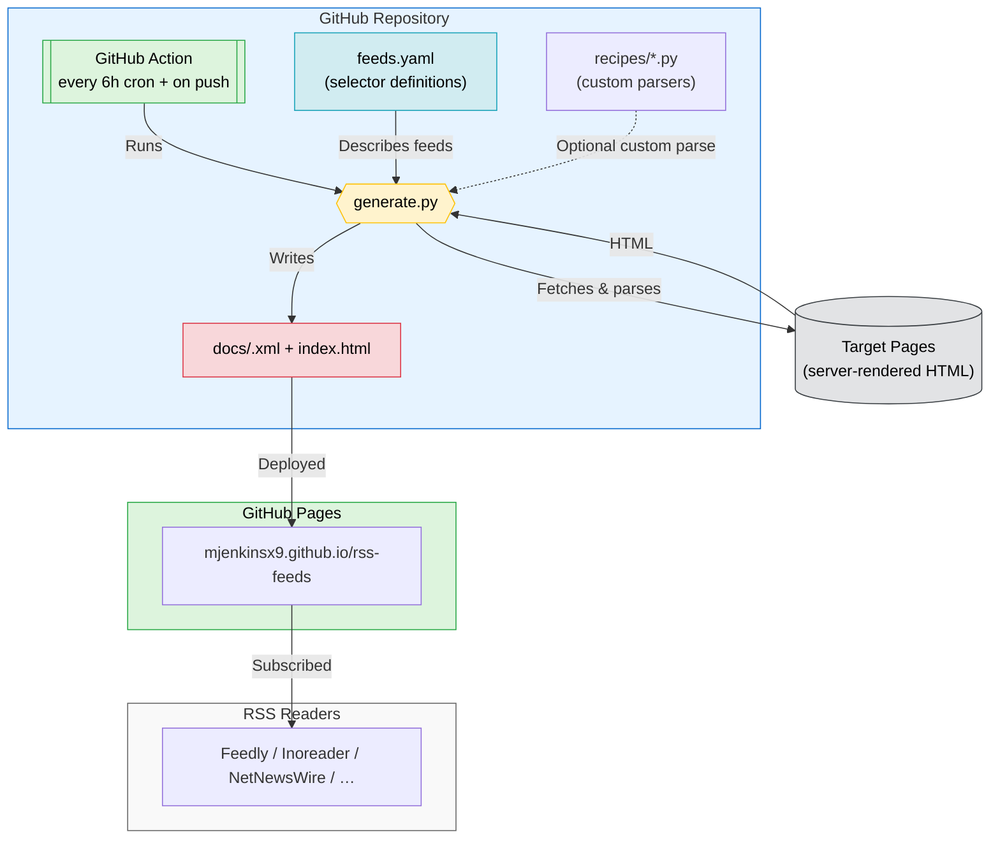

# RSS Feeds — Config-Driven RSS Feed Generator <!-- omit in toc -->

[](https://github.com/mjenkinsx9/rss-feeds/actions/workflows/build.yml)
[](https://mjenkinsx9.github.io/rss-feeds/)
[](https://www.python.org/)
[](#available-rss-feeds)
[](#versioning--release-model)
[](https://github.com/mjenkinsx9/rss-feeds/commits/main)
[](https://github.com/mjenkinsx9/rss-feeds/actions/workflows/build.yml)

> [!TIP]
> A tiny, **config-driven RSS feed generator** for changelogs, release notes,
> blogs, docs updates, and any server-rendered page. Describe the page once with
> CSS selectors in [`feeds.yaml`](./feeds.yaml); GitHub Actions rebuilds RSS 2.0
> feeds every few hours and publishes them to GitHub Pages. No server to run.

**Tags / keywords:** `rss`, `rss-feed`, `rss-generator`, `rss-feed-generator`,
`feed-generator`, `atom`, `github-pages`, `github-actions`, `python`, `yaml`,
`beautifulsoup`, `css-selectors`, `web-scraping`, `scraper`, `automation`,
`no-code`, `changelog`, `release-notes`, `slack-feed`.

## Table of Contents <!-- omit in toc -->

- [At a Glance](#at-a-glance)
- [Available RSS Feeds](#available-rss-feeds)
- [What is this?](#what-is-this)
- [Features](#features)
- [Quick Start](#quick-start)
  - [Subscribe to a Feed](#subscribe-to-a-feed)
  - [Request a Feed (just open an issue)](#request-a-feed-just-open-an-issue)
- [Add a New Feed](#add-a-new-feed)
  - [Field reference](#field-reference)
- [Sites Selectors Can't Handle](#sites-selectors-cant-handle)
- [Run Locally](#run-locally)
- [Contributing](#contributing)
- [How It Works](#how-it-works)
- [Versioning & Release Model](#versioning--release-model)
- [Limitations](#limitations)
- [Disclaimer](#disclaimer)

## At a Glance

| Category | Details |
| --- | --- |
| Output | RSS 2.0 XML with an Atom `self` link |
| Runtime | Python 3.12 with `requests`, BeautifulSoup, PyYAML, and python-dateutil |
| Hosting | Static files in `docs/`, deployed to GitHub Pages |
| Update cadence | Every 6 hours, on pushes to `main`, and on manual workflow dispatch |
| Release model | Rolling deployment from `main`; stable per-feed URLs |
| Best for | Changelogs, release notes, product blogs, docs/news pages, and public update pages |
| Consumers | Feedly, Inoreader, NetNewsWire, Thunderbird, Slack `/feed`, and other RSS readers |

## Available RSS Feeds

Feeds are rebuilt every 6 hours and served from GitHub Pages. Browse them all on the
**[landing page](https://mjenkinsx9.github.io/rss-feeds/)**.

<!-- FEEDS:START -->
| Source | Feed |
| --- | --- |
| [OpenAI Codex Changelog](https://developers.openai.com/codex/changelog) | [codex.xml](https://mjenkinsx9.github.io/rss-feeds/codex.xml) |
| [Google Cloud Blog - Application Modernization](https://cloud.google.com/blog/products/application-modernization) | [google-application-modernization.xml](https://mjenkinsx9.github.io/rss-feeds/google-application-modernization.xml) |
| [Google Cloud AI & Machine Learning Blog](https://cloud.google.com/blog/products/ai-machine-learning) | [google-ai-machine-learning-blog.xml](https://mjenkinsx9.github.io/rss-feeds/google-ai-machine-learning-blog.xml) |
<!-- FEEDS:END -->

## What is this?

You know that page you like — a changelog, a release notes page, a blog — that
doesn't have an RSS feed and probably never will?

🙌 **Describe it once in `feeds.yaml` and this repo turns it into an RSS feed for you.** 🙌

Unlike "one script per site" generators, there is a single engine
([`generate.py`](./generate.py)). Adding a feed means adding a few lines of YAML —
no new code — with an escape hatch ([`recipes/`](./recipes)) for pages too quirky
for plain selectors.

## Features

- **Config-only feed definitions** — add most feeds by editing YAML and CSS selectors.
- **Stable public feed URLs** — each enabled feed is published at `/<id>.xml` on GitHub Pages.
- **RSS-reader friendly output** — RSS 2.0 XML with `lastBuildDate`, stable `guid`s, and an Atom `self` link.
- **Slack `/feed` compatible** — feeds are served as XML from GitHub Pages for Slack and standard RSS readers.
- **Automated publishing** — GitHub Actions rebuilds and deploys feeds every 6 hours.
- **Fail-soft builds** — one broken source logs an error without blocking the other feeds from publishing.
- **Moderated feed requests** — issue-driven requests are checked against the content policy and opened as human-reviewed PRs.
- **Escape hatch for complex pages** — custom Python recipes can parse pages selectors cannot express.
- **Safety guardrails** — untrusted feed URLs are fetched with SSRF protections before publishing.

## Quick Start

### Subscribe to a Feed

- Open the **[landing page](https://mjenkinsx9.github.io/rss-feeds/)** and pick a feed, or
- Paste a feed URL straight into your reader (Feedly, Inoreader, NetNewsWire, Thunderbird, …):

  ```text
  https://mjenkinsx9.github.io/rss-feeds/codex.xml
  ```

Each feed lives at `https://mjenkinsx9.github.io/rss-feeds/<id>.xml`.

### Request a Feed (just open an issue)

Don't want to touch YAML? **[Open a feed request issue](../../issues/new?template=request-feed.yml)**
with the page's URL. A GitHub Action sends the request and the page to Claude,
which:

1. **Moderates** it against the [content policy](./CONTENT_POLICY.md) (no adult,
   violence/gore, gambling, or hateful/extremist/illegal content), and
2. if it passes, **derives the CSS selectors** and **opens a pull request**
   adding the feed, linked back to your issue.

If the page **already has a feed**, the bot skips scraping and just points you at
it — whether that's a GitHub `.atom` (releases/tags/commits/user pages), a feed
the page advertises in its `<head>` (most blogs and CMSes do this), or a URL
that's already a feed. No point reformatting a feed that already exists.

A maintainer reviews and merges the PR — **nothing is scraped or published until
then**. Whether that PR is merged or closed, your issue is closed automatically.
If the request is declined up front, the bot comments with the reason and closes
the issue. Prefer to do it yourself? Add the feed directly:

## Add a New Feed

Edit [`feeds.yaml`](./feeds.yaml) and add an entry. Open the target page,
right-click an entry → **Inspect**, and find CSS selectors for the repeating item,
its title, date, and body.

```yaml
- id: my-site                 # -> https://mjenkinsx9.github.io/rss-feeds/my-site.xml
  title: My Site Updates
  url: https://my-site.com/news
  item: "article.post"        # selector matching ONE entry
  entry_title: "h2 a"         # title, within an item
  body: ".summary"            # description HTML, within an item
  date:
    selector: "time"
    attr: "datetime"          # ISO date in an attribute...
    # format: "%b %d, %Y"     # ...or a strptime format if it's plain text
    # regex: '20\d{2}-\d{2}-\d{2}'   # ...or pull a date out of the item text
  link:
    selector: "h2 a"
    attr: "href"
    # base_anchor: true       # or: link = page url + '#' + slug(title)
  max_items: 50
```

Run `python generate.py` locally to preview, then commit and push — the Action
rebuilds everything and republishes to Pages.

### Field reference

| field                         | meaning                                                       |
| ----------------------------- | ------------------------------------------------------------ |
| `id`                          | slug; the feed is published at `<id>.xml`                     |
| `title`                       | feed title                                                    |
| `url`                         | page to scrape                                                |
| `item`                        | CSS selector matching one entry (**required**)               |
| `entry_title`                 | selector for the headline (omit = use item text)             |
| `body`                        | selector for the description HTML                            |
| `date.selector` / `date.attr` | where to read the date; `attr` reads an attribute            |
| `date.format`                 | `strptime` format if the date isn't ISO                       |
| `date.regex`                  | pull a date from the item's text instead                     |
| `link.selector` / `link.attr` | where to read the item link                                  |
| `link.base_anchor`            | `true` → link = `url#slug(title)`                             |
| `description`                 | feed description (optional)                                   |
| `max_items`                   | cap the item count                                           |
| `disabled`                    | `true` → skip this feed                                       |
| `recipe`                      | use a custom parser in `recipes/` (see below)                |

## Sites Selectors Can't Handle

Some pages need real logic (odd markup, combining fields, etc.). Drop a Python
module in [`recipes/`](./recipes) that exports `parse(html, cfg)` returning a list of
`{"title", "date", "link", "html"}` dicts, then reference it:

```yaml
- id: tricky
  title: Tricky Site
  url: https://example.com
  recipe: example_recipe      # -> recipes/example_recipe.py
```

See [`recipes/example_recipe.py`](./recipes/example_recipe.py) for a starting point.

## Run Locally

The GitHub Action runs on Python 3.12. To preview the same generated files locally:

```bash
python -m pip install -r requirements.txt
python generate.py      # writes docs/<id>.xml and docs/index.html
```

## Contributing

Contributions are welcome for feed requests, selector fixes, recipes, docs, and
workflow improvements.

- Request a feed by opening a [feed request issue](../../issues/new?template=request-feed.yml).
- Add or fix a feed by editing [`feeds.yaml`](./feeds.yaml), then run `python generate.py`.
- Add a recipe in [`recipes/`](./recipes) only when CSS selectors are not enough.
- Do not hand-edit the generated feed table; run
  [`.github/scripts/update_readme.py`](./.github/scripts/update_readme.py) after changing feeds.

## How It Works



A broken feed logs an error but does **not** fail the whole run — the other feeds
still publish. Change the cadence via the `cron:` line in
[`.github/workflows/build.yml`](./.github/workflows/build.yml). If you rename the
repo, update `SITE_BASE_URL` near the top of `generate.py`.

## Versioning & Release Model

This repository is a hosted feed service rather than a packaged library.

- **Feed URLs are stable and versionless:** subscribe to `https://mjenkinsx9.github.io/rss-feeds/<id>.xml`.
- **Deployment version:** the latest successful GitHub Pages deployment from `main`.
- **Feed freshness:** each generated feed includes `lastBuildDate`; items use stable `guid` values.
- **Engine changes:** track implementation changes through commits, pull requests, and Actions runs.
- **Future releases:** if the engine is packaged separately, Git tags/releases should use semantic versioning.

## Limitations

- The Action uses a plain HTTP fetch, so it reads a page's **server-rendered HTML**.
  Pages that build their entire list with client-side JavaScript may return nothing —
  for those, use a service like RSS.app or add a headless-browser (Playwright) step.
- Built with a single, polite User-Agent; each page is fetched once per run.
- No database or historical archive is kept; the generated XML files are the persistent output.

## Disclaimer

This project only reformats publicly available pages into RSS. It is not affiliated
with or endorsed by the sites it indexes; their content remains theirs.
